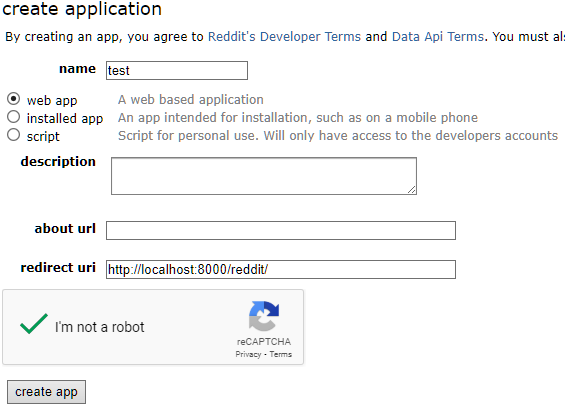

#Installation

```sh
pip install django praw python-dotenv
```

#setup the reddit api if necessary

1. go to https://old.reddit.com/prefs/apps/
2. click on "create another app"
3. add the name and redirect uri
4. make sure that redirect uri is set to http://localhost:8000/reddit/
5. create .env and set up the variables
   CLIENT_ID=<your-client-id> # under the personal use script
   SECRET=<your-secret> # inside your app data
   USER_AGENT=redditTestScript by u/<your-username> # has to be unique
   
6. open the terminal in this folder and run

```sh
python manage.py runserver
```

7. go to http://127.0.0.1:8000/reddit/
